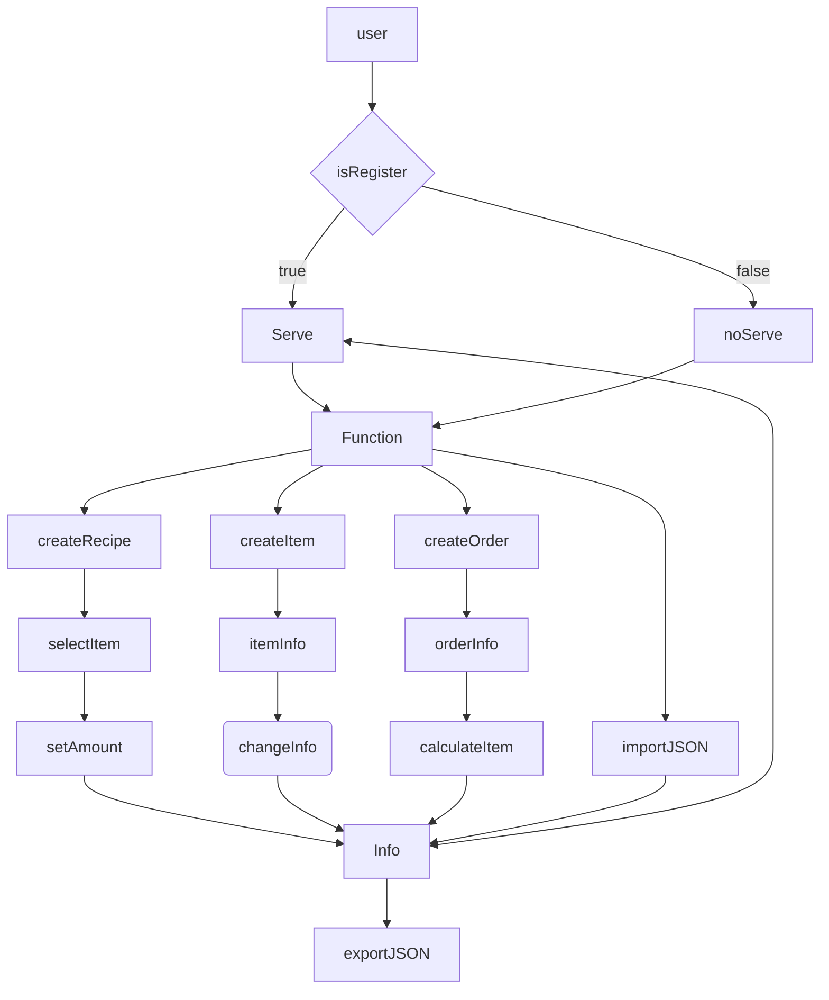

# 配方工坊（开发前）

## 明确产品目标

目标用户：游戏玩家或对配方计算有需求的用户

痛点：在复杂情景下，物品合成需要经过多次配方合成，原料计算复杂

产品目标：通过自定义配方/物品，创建合成订单，快速计算原料需求

产品愿景：方便用户快速计算原料需求

## 用户行为路径

- 创建配方
- 管理库存
- 创建订单
- 计算原料
- 输出清单

## 产品功能罗列

- 注册

- 登录

- 创建配方

- 更改配方

- 创建物品（数量、物品、图标）

- 管理物品

- 创建订单

- 原料计算

- 计算结果导出

- 订单批量计算

- 订单多重计算

- 数据导入导出（Rcipe/Item/Order）

- 云服务

  

  

## 功能优先级

- 创建配方
- 创建物品
- 创建订单
- 原料计算
- 管理物品
- 更改配方
- 订单批量计算
- 计算结果导出
- 数据导入导出
- 云服务
- 注册
- 登录

